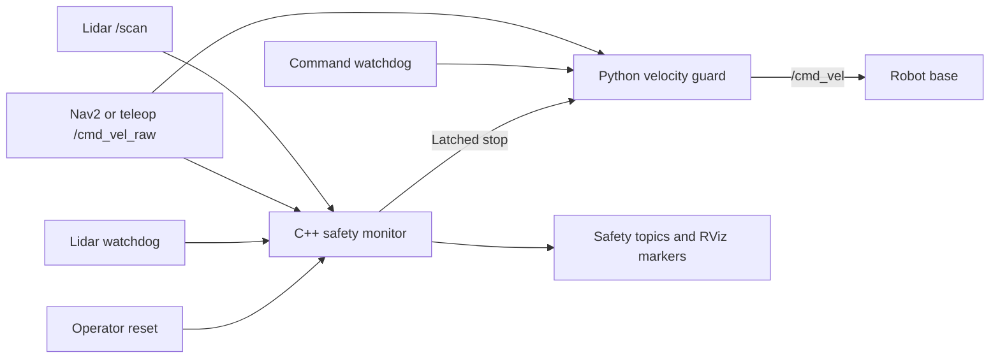

# Project 1: ROS 2 Robot Safety Monitor

A fail-safe ROS 2 safety layer that prevents a mobile robot from driving into
obstacles, operating without fresh lidar data, or continuing to move after its
velocity-command source stops publishing.

A C++ safety monitor evaluates forward lidar ranges, monitors sensor health,
and calculates a velocity-dependent stopping distance from the commanded
forward speed. A Python velocity guard sits between Nav2 or teleoperation and
the robot base, forwarding safe commands while replacing unsafe or stale
commands with zero velocity.

The project includes C++ unit tests for lidar processing and dynamic stopping,
plus ROS 2 launch integration tests for lidar-watchdog behavior and
velocity-command timeout protection. RViz markers display the active stopping
zone, minimum clearance, lidar health, and latched safety state.

## What this project showcases

- ROS 2 Jazzy nodes, topics, services, parameters, launch files, timers, and QoS
- C++ and Python nodes working together in one safety system
- Object-oriented design and separation of sensing, decisions, and actuation
- `sensor_msgs/msg/LaserScan`, `geometry_msgs/msg/Twist`,
  `std_msgs/msg/Bool`, `std_msgs/msg/Float32`,
  `std_srvs/srv/Trigger`, and `visualization_msgs/msg/MarkerArray`
- Forward-sector lidar processing with conservative invalid-range handling
- Velocity-dependent stopping distance using reaction and braking distance
- Dynamic release distance with hysteresis
- Latched emergency-stop behavior and operator-controlled reset
- Fail-safe startup and stale-lidar watchdog protection
- Velocity-command freshness monitoring and automatic zero-velocity output
- Dynamic RViz safety-zone and diagnostic-status visualization
- C++ unit testing and automated ROS 2 launch integration testing
- CMake, colcon, YAML, Git, Bash, Linux, and Docker
- Repeatable sensor and command failure injection
- Regression testing of safety-critical behavior

This project is intentionally smaller than a complete navigation system. Its
purpose is to demonstrate safe ROS 2 communication, fault handling, testing,
and robot integration before adding Nav2, SLAM, localization, and autonomous
mission behaviors.

## Architecture



The safety monitor uses current lidar clearance and commanded forward velocity
to decide whether motion is safe. The velocity guard uses the resulting
latched-stop state and command freshness to control whether a requested command
reaches the robot.

```text
Without safety layer:
Nav2 or teleop → /cmd_vel → robot

With safety layer:
Nav2 or teleop → /cmd_vel_raw → velocity guard → /cmd_vel → robot
                       │              ↑
                       └→ safety monitor
                            │
                            └→ safety state and RViz markers
```

## ROS 2 interfaces

| Interface | Type | Purpose |
| --- | --- | --- |
| `/scan` | `sensor_msgs/msg/LaserScan` | Supplies lidar range measurements |
| `/cmd_vel_raw` | `geometry_msgs/msg/Twist` | Supplies requested velocity to the monitor and guard |
| `/safety/stop` | `std_msgs/msg/Bool` | Publishes the latched safety-stop state |
| `/safety/min_clearance` | `std_msgs/msg/Float32` | Publishes the closest usable forward lidar return |
| `/safety/active_stop_distance` | `std_msgs/msg/Float32` | Publishes the stopping threshold calculated for the current velocity |
| `/safety/cmd_vel_fresh` | `std_msgs/msg/Bool` | Reports whether the raw velocity command is recent |
| `/safety/markers` | `visualization_msgs/msg/MarkerArray` | Publishes the dynamic RViz safety zone and status text |
| `/safety/reset` | `std_srvs/srv/Trigger` | Clears the latch only when reset conditions are safe |
| `/cmd_vel` | `geometry_msgs/msg/Twist` | Sends guarded velocity commands to the robot base |

## Safety configuration

The safety parameters are stored in `config/safety.yaml`:

```yaml
safety_monitor:
  ros__parameters:
    stop_distance: 0.45
    release_distance: 0.60
    field_of_view_degrees: 60.0
    scan_timeout: 0.50

    reaction_time: 0.25
    braking_deceleration: 0.80
    max_stop_distance: 1.50

velocity_guard:
  ros__parameters:
    cmd_vel_timeout: 0.50
```

| Parameter | Node | Value | Purpose |
| --- | --- | ---: | --- |
| `stop_distance` | Safety Monitor | 0.45 m | Minimum stopping threshold at zero forward speed |
| `release_distance` | Safety Monitor | 0.60 m | Base reset threshold and source of the hysteresis margin |
| `field_of_view_degrees` | Safety Monitor | 60° | Monitored forward lidar sector |
| `scan_timeout` | Safety Monitor | 0.50 s | Maximum permitted age of the latest lidar scan |
| `reaction_time` | Safety Monitor | 0.25 s | Estimated delay before braking begins |
| `braking_deceleration` | Safety Monitor | 0.80 m/s² | Assumed available braking deceleration |
| `max_stop_distance` | Safety Monitor | 1.50 m | Maximum permitted dynamic stopping threshold |
| `cmd_vel_timeout` | Velocity Guard | 0.50 s | Maximum permitted age of the latest raw velocity command |

Keeping these values in YAML allows the safety behavior to be adjusted for
different robots and sensors without recompiling either node.

## Velocity-dependent stopping distance

A fixed threshold does not account for the fact that a faster robot needs more
distance to react and brake. The monitor therefore calculates:

```text
active stop distance = base distance
                     + forward speed × reaction time
                     + forward speed² / (2 × deceleration)
```

In mathematical form:

\[
d_{active} = \min\left(
  d_{max},
  d_{base} + vt_r + \frac{v^2}{2a}
\right)
\]

where:

- `d_base` is `stop_distance`
- `v` is the non-negative commanded forward velocity
- `t_r` is `reaction_time`
- `a` is `braking_deceleration`
- `d_max` is `max_stop_distance`

Reverse velocity is treated as zero by this forward-sector calculation. Reverse
protection is intentionally listed as a future extension.

With the default parameters:

| Forward velocity | Reaction distance | Braking distance | Active stop distance |
| ---: | ---: | ---: | ---: |
| 0.0 m/s | 0.00000 m | 0.00000 m | 0.45000 m |
| 0.5 m/s | 0.12500 m | 0.15625 m | 0.73125 m |
| 1.0 m/s | 0.25000 m | 0.62500 m | 1.32500 m |
| 2.0 m/s | 0.50000 m | 2.50000 m | 1.50000 m, capped |

The dynamic release distance preserves the configured hysteresis margin:

```text
hysteresis margin = release_distance - stop_distance
                  = 0.60 - 0.45
                  = 0.15 m

active release distance = active stop distance + 0.15 m
```

At `0.5 m/s`, the active stop distance is `0.73125 m`, so reset requires at
least `0.88125 m` of valid forward clearance.

## Why each design choice is used

- **C++ for lidar and stopping calculations:** lidar callbacks can arrive
  frequently, and C++ provides efficient robot-side processing while
  demonstrating production-style ROS 2 development.

- **Python for command guarding:** the velocity-gating policy is concise and
  easy to inspect, extend, and test. It also demonstrates multi-language ROS 2
  integration.

- **Forward field of view:** the robot monitors the region relevant to forward
  motion instead of stopping for obstacles behind it. The angle is configurable.

- **Conservative lidar-return handling:** `NaN`, infinite, zero, negative, and
  above-maximum readings are ignored individually. A finite positive reading
  below `range_min` is retained as a possible obstacle that is too close for
  reliable measurement.

- **Velocity-dependent threshold:** faster forward motion increases reaction
  and braking distance, so the safety zone expands before the robot reaches an
  obstacle.

- **Maximum threshold:** `max_stop_distance` prevents an invalid or extreme
  command from creating an unbounded threshold.

- **Dynamic release hysteresis:** the same 0.15 m gap between stopping and
  releasing is preserved as velocity changes, preventing unstable switching.

- **Latched stop:** one clear scan cannot automatically restart the robot after
  an unsafe event. An operator must explicitly request a reset.

- **Fail-safe startup:** the system starts with the safety stop latched. Movement
  is not permitted until valid lidar data arrives, the path is clear, and reset
  is requested.

- **Lidar watchdog:** a timer checks the age of the latest `/scan` message. If
  data becomes stale, the system assumes environmental information is
  unavailable and latches the safety stop.

- **Command-velocity watchdog:** the guard checks the arrival time of
  `/cmd_vel_raw`. If the command source stops publishing for longer than
  `cmd_vel_timeout`, the guard marks the command stale and continuously
  publishes zero velocity.

- **Immediate stop enforcement:** receiving `/safety/stop = true` causes the
  velocity guard to publish a zero `Twist` immediately instead of waiting for
  another raw command.

- **Validated reset service:** reset is rejected if lidar data is missing,
  stale, invalid, or an obstacle remains inside the active release distance.

- **Transient-local state QoS:** a late-starting velocity guard immediately
  receives the most recent stop state. Monitoring tools can also obtain the
  latest active stopping distance and visualization state.

- **RViz MarkerArray visualization:** the stopping-zone radius is generated
  from the real dynamic threshold. Green indicates a clear state, red indicates
  a latched stop, and the text marker reports clearance, threshold, and stale
  lidar status.

- **Finite marker lifetime:** markers expire if the Safety Monitor stops
  publishing, preventing RViz from displaying an outdated safe condition.

- **Pure C++ safety logic:** lidar evaluation and stopping-distance calculation
  are separated from ROS APIs, allowing both calculations to be unit-tested.

- **Automated integration testing:** the real nodes are launched and exercised
  through ROS topics and services, providing repeatable regression coverage
  for both lidar and velocity-command watchdog behavior.

## Repository layout

```text
robot_safety_monitor/
├── config/
│   └── safety.yaml
├── docker/
│   └── Dockerfile
├── include/robot_safety_monitor/
│   └── safety_logic.hpp
├── launch/
│   └── safety_system.launch.py
├── scripts/
│   ├── demo_scan_publisher.py
│   └── velocity_guard.py
├── src/
│   └── safety_monitor.cpp
├── test/
│   ├── test_safety_logic.cpp
│   ├── test_velocity_guard_launch.py
│   └── test_watchdog_launch.py
├── CMakeLists.txt
├── LICENSE
├── package.xml
└── README.md
```

## Part 1 — Build and run

### 1. Prepare the workspace

Use Ubuntu 24.04 with ROS 2 Jazzy:

```bash
mkdir -p ~/robotics_ws/src

cd ~/robotics_ws

source /opt/ros/jazzy/setup.bash

rosdep install --from-paths src --ignore-src -r -y

colcon build \
  --symlink-install \
  --packages-select robot_safety_monitor

source install/setup.bash
```

A colcon workspace keeps source, build, installation, and log files separate.
The `--symlink-install` option makes iteration on Python scripts and launch files
faster.

### 2. Launch the safety system

```bash
source /opt/ros/jazzy/setup.bash
source ~/robotics_ws/install/setup.bash

ros2 launch robot_safety_monitor safety_system.launch.py
```

The launch file starts `safety_monitor_node` and `velocity_guard` and loads
`config/safety.yaml`.

The system begins with the stop latched because no validated lidar data has
arrived yet.

### 3. Start the synthetic lidar publisher

In a second terminal:

```bash
source /opt/ros/jazzy/setup.bash
source ~/robotics_ws/install/setup.bash

ros2 run robot_safety_monitor demo_scan_publisher
```

The synthetic publisher produces repeatable `LaserScan` messages without
requiring Gazebo or physical hardware. Its default obstacle is at 2.0 m.

Reset the startup latch:

```bash
ros2 service call /safety/reset std_srvs/srv/Trigger "{}"
```

Expected response:

```text
success: true
message: Safety stop cleared.
```

Verify the safety state:

```bash
ros2 topic echo /safety/stop --once
```

Expected:

```text
data: false
```

### 4. Simulate an obstacle

Move the obstacle inside the stopping distance:

```bash
ros2 param set /demo_scan_publisher obstacle_distance 0.30
```

The monitor should latch the stop and `/safety/stop` should become `true`.

A reset request must fail while the obstacle remains too close:

```bash
ros2 service call /safety/reset std_srvs/srv/Trigger "{}"
```

Expected:

```text
success: false
message: Reset rejected: obstacle remains inside the release distance.
```

### 5. Clear the obstacle and reset

```bash
ros2 param set /demo_scan_publisher obstacle_distance 2.0

ros2 service call /safety/reset std_srvs/srv/Trigger "{}"
```

Expected:

```text
success: true
message: Safety stop cleared.
```

### 6. Connect a robot command source

For TurtleBot3 teleoperation, remap its normal output to the guarded input:

```bash
ros2 run turtlebot3_teleop teleop_keyboard \
  --ros-args \
  -r /cmd_vel:=/cmd_vel_raw
```

The velocity guard becomes the only node allowed to publish final `/cmd_vel`
commands.

```text
Safe:    /cmd_vel_raw → forwarded command → /cmd_vel
Stopped: /cmd_vel_raw → zero Twist         → /cmd_vel
```

### 7. Inspect the ROS system

```bash
ros2 topic echo /safety/min_clearance
ros2 topic echo /safety/active_stop_distance
ros2 topic echo /safety/stop
ros2 node info /safety_monitor
ros2 topic hz /scan
ros2 service type /safety/reset
```

## Part 2 — C++ unit testing

Run the package tests:

```bash
cd ~/robotics_ws

source /opt/ros/jazzy/setup.bash
source install/setup.bash

colcon test --packages-select robot_safety_monitor

colcon test-result --verbose
```

The C++ tests validate safety calculations without requiring a running ROS
graph.

### Lidar-processing tests

The five `SafetyLogic` tests verify that the calculation:

- Finds the closest frontal obstacle
- Ignores obstacles outside the configured field of view
- Ignores `NaN`, infinity, zero, and negative readings
- Treats a finite positive return below `range_min` as a hazard
- Returns infinity when no usable reading exists

### Dynamic-distance tests

The five `DynamicStopDistance` tests verify that the calculation:

- Returns the base distance at zero speed
- Treats reverse speed as zero for the forward sector
- Includes reaction and braking distance
- Increases as forward speed increases
- Respects the configured maximum distance

Validated result:

```text
Running 10 tests from 2 test suites.
[  PASSED  ] 10 tests.
```

## Part 3 — Lidar watchdog and fail-safe recovery

### Problem

Obstacle detection is insufficient if the lidar stops publishing. Without a
sensor-health check, the robot could retain an old safe state even though current
environmental information is unavailable.

Possible failures include:

- Lidar disconnection
- Sensor power loss
- Driver-node crash
- ROS communication failure
- Network interruption
- Frozen or stalled sensor publication

### Solution

Every `/scan` callback records the latest arrival time:

```cpp
last_scan_time_ = now();
```

A watchdog timer executes every 100 milliseconds and checks the scan age:

```text
Scan age <= scan_timeout → lidar is fresh
Scan age > scan_timeout  → latch the safety stop
```

If lidar becomes stale, the monitor reports:

```text
SAFETY STOP: Lidar data timed out.
```

### Fail-safe reset conditions

The `/safety/reset` service accepts a reset only when:

- At least one lidar message has been received
- The latest scan is fresh
- The scan contains valid ranges
- The closest obstacle is outside the active release distance

A clear scan does not automatically restart the robot. An explicit reset remains
required after every unsafe event.

### Manual watchdog test

Stop only the synthetic lidar publisher using `Ctrl+C`. After the configured
timeout, verify:

```bash
ros2 topic echo /safety/stop --once
```

Expected:

```text
data: true
```

Attempt a reset while lidar is unavailable:

```bash
ros2 service call /safety/reset std_srvs/srv/Trigger "{}"
```

Expected:

```text
success: false
message: Reset rejected: lidar data is missing or stale.
```

Restart the lidar publisher and reset after fresh clear scans arrive.

### Manual watchdog results

| Test condition | Expected behavior | Result |
| --- | --- | --- |
| System starts before lidar data arrives | Safety stop remains latched | Passed |
| Valid scan with obstacle at 2.0 m | Reset accepted | Passed |
| Obstacle moved to 0.30 m | Safety stop latched | Passed |
| Reset requested with close obstacle | Reset rejected | Passed |
| Lidar publisher stopped | Stop triggered after timeout | Passed |
| Reset requested without fresh lidar | Reset rejected | Passed |
| Lidar restarted with a clear path | Reset accepted | Passed |

## Part 4 — Automated watchdog integration testing

The package includes a ROS 2 launch test that starts the real
`safety_monitor_node` and verifies its watchdog through topics and a service.

The test validates:

- Node startup
- Test-specific parameters
- ROS message delivery
- QoS compatibility
- Reset-service communication
- Watchdog-timer behavior
- Process shutdown

### Automated sequence

1. Start the monitor with a 0.30-second test timeout.
2. Confirm that startup begins with the stop latched.
3. Publish clear lidar scans with 2.0 m clearance.
4. Call `/safety/reset`.
5. Confirm that reset succeeds and `/safety/stop` becomes `false`.
6. Stop publishing scans to simulate lidar failure.
7. Wait for the watchdog timeout.
8. Confirm that `/safety/stop` returns to `true`.
9. Attempt another reset with stale data.
10. Confirm that the unsafe reset is rejected.

### Run only the watchdog test

```bash
cd ~/robotics_ws

source /opt/ros/jazzy/setup.bash
source install/setup.bash

colcon test \
  --packages-select robot_safety_monitor \
  --ctest-args -R watchdog --output-on-failure

colcon test-result --verbose
```

Validated result:

```text
100% tests passed, 0 tests failed out of 1
Summary: 2 tests, 0 errors, 0 failures, 0 skipped
```

The optional post-shutdown phase reports zero tests because the project does not
define post-shutdown assertions. This is expected and is not a failure.

## Part 5 — Velocity-dependent stopping validation

### Confirm the active-distance topic

```bash
ros2 topic info /safety/active_stop_distance -v
```

Expected type:

```text
std_msgs/msg/Float32
```

### Test zero velocity

```bash
ros2 topic pub --once /cmd_vel_raw geometry_msgs/msg/Twist \
"{linear: {x: 0.0}, angular: {z: 0.0}}"

ros2 topic echo /safety/active_stop_distance --once
```

Validated result:

```text
data: 0.45
```

### Test moderate forward velocity

```bash
ros2 topic pub --once /cmd_vel_raw geometry_msgs/msg/Twist \
"{linear: {x: 0.5}, angular: {z: 0.0}}"

ros2 topic echo /safety/active_stop_distance --once
```

Validated result:

```text
data: 0.73125
```

A minor representation difference such as `0.731249988` is normal for a
`Float32` message.

### Test the maximum-distance cap

```bash
ros2 topic pub --once /cmd_vel_raw geometry_msgs/msg/Twist \
"{linear: {x: 3.0}, angular: {z: 0.0}}"

ros2 topic echo /safety/active_stop_distance --once
```

Validated result:

```text
data: 1.5
```

### Validate the dynamic stop decision

First establish a safe stationary condition:

```bash
ros2 topic pub --once /cmd_vel_raw geometry_msgs/msg/Twist \
"{linear: {x: 0.0}, angular: {z: 0.0}}"

ros2 param set /demo_scan_publisher obstacle_distance 2.0

ros2 service call /safety/reset std_srvs/srv/Trigger "{}"
```

Move the obstacle to `0.60 m`. At zero velocity, the active threshold remains
`0.45 m`, so the stop stays clear:

```text
minimum clearance:     0.60 m
active stop distance:  0.45 m
safety stop:           false
```

Without moving the obstacle, command `0.5 m/s`:

```bash
ros2 topic pub --once /cmd_vel_raw geometry_msgs/msg/Twist \
"{linear: {x: 0.5}, angular: {z: 0.0}}"
```

The active threshold increases to `0.73125 m`. Because `0.60 m` is now inside
the active threshold, the monitor latches the stop:

```text
SAFETY STOP: Obstacle entered the dynamic stopping zone.
```

Validated state:

```text
data: true
```

### Validate dynamic reset rejection

At `0.5 m/s`, the active release distance is `0.88125 m`. A reset with the
obstacle at `0.60 m` is therefore rejected:

```bash
ros2 service call /safety/reset std_srvs/srv/Trigger "{}"
```

Validated result:

```text
success: false
message: Reset rejected: obstacle remains inside the release distance.
```

### Validate safe recovery

Return velocity to zero, move the obstacle to 2.0 m, and reset:

```bash
ros2 topic pub --once /cmd_vel_raw geometry_msgs/msg/Twist \
"{linear: {x: 0.0}, angular: {z: 0.0}}"

ros2 param set /demo_scan_publisher obstacle_distance 2.0

ros2 service call /safety/reset std_srvs/srv/Trigger "{}"
```

Validated result:

```text
success: true
message: Safety stop cleared.
active stop distance: 0.45 m
safety stop: false
```

### Dynamic-stopping results

| Test condition | Expected behavior | Result |
| --- | --- | --- |
| Velocity 0.0 m/s | Active distance is 0.45 m | Passed |
| Velocity 0.5 m/s | Active distance is 0.73125 m | Passed |
| Velocity 3.0 m/s | Active distance is capped at 1.50 m | Passed |
| Obstacle 0.60 m at zero speed | Stop remains clear | Passed |
| Same obstacle at 0.5 m/s | Dynamic stop latches | Passed |
| Reset while obstacle is inside dynamic release distance | Reset rejected | Passed |
| Velocity zero and obstacle returned to 2.0 m | Reset succeeds | Passed |

## Part 6 — Command-velocity watchdog

The Velocity Guard does not allow the robot to continue using an old motion
command after a planner, teleoperation node, or networked command source stops
publishing. It records the arrival time of `/cmd_vel_raw` and compares its age
with `cmd_vel_timeout`.

The guard begins with:

```text
safety stop: true
command fresh: false
output velocity: zero
```

When the safety state is clear and a recent command exists, the requested
`Twist` is forwarded. When the command becomes stale, the guard publishes:

```text
/safety/cmd_vel_fresh: false
/cmd_vel: zero Twist
```

Receiving `/safety/stop = true` also produces an immediate zero command, even
when the raw command is still fresh.

The launch integration test validates this sequence:

1. Startup command freshness is false.
2. A fresh nonzero command is forwarded while safety is clear.
3. `/safety/cmd_vel_fresh` becomes true.
4. Freshness becomes false after `cmd_vel_timeout`.
5. `/cmd_vel` receives a zero `Twist` after timeout.
6. A new command restores freshness and forwarding.
7. A safety stop immediately overrides a fresh command with zero velocity.

Run only this integration test with:

```bash
cd ~/robotics_ws
source /opt/ros/jazzy/setup.bash
source install/setup.bash

colcon test \
  --packages-select robot_safety_monitor \
  --event-handlers console_direct+ \
  --ctest-args -R test_velocity_guard_launch --output-on-failure
```

## Part 7 — RViz safety visualization

The Safety Monitor publishes `/safety/markers` as a
`visualization_msgs/msg/MarkerArray`. The visualization contains:

- A forward `LINE_STRIP` showing the active stopping sector
- A radius that grows with the velocity-dependent stopping distance
- Green markers when the safety state is clear
- Red markers when the stop is latched or lidar is stale
- Status text containing `SAFE` or `STOP`
- Active stopping distance and minimum clearance
- A `LIDAR STALE` warning when scan data times out

The marker uses the frame ID from the latest `LaserScan`. With the synthetic
publisher, that frame is `demo_laser`. To view it under a `world` fixed frame,
start a static transform:

```bash
ros2 run tf2_ros static_transform_publisher \
  --x 0 --y 0 --z 0 \
  --roll 0 --pitch 0 --yaw 0 \
  --frame-id world \
  --child-frame-id demo_laser
```

Start RViz:

```bash
rviz2
```

Configure RViz with:

1. Fixed Frame: `world` or `demo_laser`
2. `/scan`: `LaserScan` display with Best Effort reliability
3. `/safety/markers`: `MarkerArray` display
4. Top-down view centered on the sensor origin

Validated visualization results:

| Condition | Expected visualization | Result |
| --- | --- | --- |
| Zero forward speed | Stop distance displays 0.45 m | Passed |
| Forward speed 0.5 m/s | Sector grows to approximately 0.73 m | Passed |
| Clear obstacle at 2.0 m | Green `SAFE` after reset | Passed |
| Obstacle at 0.30 m | Red `STOP` with 0.30 m clearance | Passed |
| Lidar timeout | Red `STOP` with `LIDAR STALE` | Passed |
| Successful safe reset | Marker changes from red to green | Passed |

The marker lifetime is 0.30 seconds and the watchdog refreshes it every
0.10 seconds. If the node stops publishing, RViz removes the stale marker.

## Part 8 — Conservative below-minimum lidar policy

Sensor drivers may report a finite positive distance below the declared
`LaserScan.range_min`. Discarding that measurement could hide an object that is
extremely close to the robot. The project therefore applies this policy:

| Reading | Treatment |
| --- | --- |
| `NaN` or infinity | Ignore the individual reading |
| Zero or negative | Ignore the individual reading |
| Greater than `range_max` | Ignore the individual reading |
| Finite, positive, below `range_min` | Retain as a possible close obstacle |
| No usable readings | Return infinity; the ROS node latches a stop |

Manual validation used:

```bash
ros2 run robot_safety_monitor demo_scan_publisher \
  --ros-args -p obstacle_distance:=0.05
```

With `range_min = 0.10 m`, the system produced:

```text
minimum clearance: 0.05 m
safety state: STOP
reset while obstacle remains: rejected
RViz marker: red
```

After changing the obstacle to `2.0 m`, the stop remained latched until the
reset service succeeded. The final state was green `SAFE` with 2.0 m clearance.

The synthetic scan background is 5.0 m. Therefore, setting
`obstacle_distance` above `range_max` causes that sample to be ignored, while
the remaining valid background readings produce a 5.0 m minimum clearance.

## Complete automated-test result

The complete package suite includes C++ unit tests, two launch integration
tests, and ROS lint checks.

Validated output:

```text
100% tests passed, 0 tests failed out of 11
Summary: 50 tests, 0 errors, 0 failures, 3 skipped
```

The checks include:

- `test_safety_logic`
- `test_test_watchdog_launch.py`
- `test_test_velocity_guard_launch.py`
- `copyright`
- `cppcheck`
- `cpplint`
- `flake8`
- `lint_cmake`
- `pep257`
- `uncrustify`
- `xmllint`

The cppcheck wrapper may report that cppcheck 2.13 is skipped because of known
performance issues. The ROS test wrapper treats this as an intentional skip, not
a test failure.

## Demo experiment and measurable results

Record the relevant topics while driving toward an obstacle:

```bash
ros2 bag record \
  /scan \
  /safety/stop \
  /safety/min_clearance \
  /safety/active_stop_distance \
  /safety/cmd_vel_fresh \
  /safety/markers \
  /cmd_vel_raw \
  /cmd_vel
```

Future measured results will include:

| Metric | Measurement method | Target |
| --- | --- | --- |
| Stop-threshold error | Actual clearance minus active threshold | Within one lidar range bin |
| Stop-reaction latency | Unsafe scan or velocity command to first zero `/cmd_vel` | Below 100 ms in simulation |
| Watchdog latency | Last scan timestamp to latched stop | Timeout plus one timer period |
| False stops | Stops during five clear-path runs | 0 |
| Unsafe resets | Accepted resets while obstacle or stale lidar remains | 0 |

## Completed milestones

- [x] Create the ROS 2 CMake package
- [x] Implement forward-sector lidar processing in C++
- [x] Publish minimum clearance and latched stop state
- [x] Implement the Python velocity-command guard
- [x] Add YAML parameters and a combined launch file
- [x] Add configurable stop and release distances
- [x] Add reset validation and hysteresis
- [x] Add fail-safe startup behavior
- [x] Add lidar-timeout watchdog protection
- [x] Manually validate obstacle and lidar-failure behavior
- [x] Add automated ROS 2 watchdog integration testing
- [x] Add velocity-dependent stopping-distance calculation
- [x] Subscribe to `/cmd_vel_raw` in the safety monitor
- [x] Publish `/safety/active_stop_distance`
- [x] Add dynamic release-distance validation
- [x] Add five dynamic stopping-distance unit tests
- [x] Validate dynamic stopping and safe recovery at runtime
- [x] Add configurable command-velocity timeout protection
- [x] Publish `/safety/cmd_vel_fresh`
- [x] Publish zero velocity when commands become stale
- [x] Immediately stop output when `/safety/stop` becomes true
- [x] Add automated Velocity Guard launch integration testing
- [x] Publish a dynamic RViz stopping-sector marker
- [x] Display safety state, stopping distance, and clearance in RViz
- [x] Display stale-lidar status in RViz
- [x] Treat finite positive below-minimum lidar returns as hazards
- [x] Add unit-test coverage for practical lidar-return handling
- [x] Validate below-minimum obstacle handling at runtime
- [x] Pass the complete build, test, and lint suite

## Next implementation parts

1. Add reverse-direction protection with a rear lidar sector.
2. Save a reusable RViz configuration file.
3. Add a rosbag analysis script and measure safety-response latency.
4. Add GitHub Actions for automatic build and test execution.
5. Integrate the safety layer with TurtleBot3 Gazebo and Nav2.
6. Record a repeatable portfolio demonstration.

Project 2 will reuse this safety layer below Nav2 while adding SLAM,
localization, ArUco perception, and a behavior tree.

## License

This project is licensed under the Apache License 2.0. See `LICENSE` for details.
