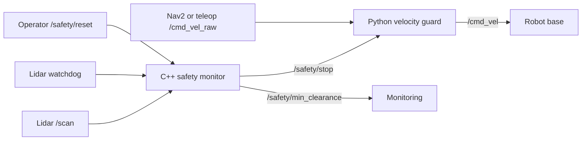

# Project 1: ROS 2 Robot Safety Monitor

An interview-ready ROS 2 safety system that prevents a mobile robot from driving
into obstacles or operating without fresh lidar data.

A C++ safety monitor evaluates forward lidar ranges, monitors sensor health, and
publishes a latched safety-stop state. A Python velocity guard sits between Nav2
or teleoperation and the robot base, forwarding safe commands while replacing
unsafe commands with zero velocity.

The project includes unit tests for lidar-processing logic and an automated ROS 2
integration test that verifies startup protection, lidar-timeout detection, reset
validation, and safe fault recovery.

## What this project showcases

- ROS 2 Jazzy nodes, topics, services, parameters, launch files, timers, and QoS
- C++ and Python nodes working together in one safety system
- Object-oriented design and separation of sensing, decisions, and actuation
- `sensor_msgs/msg/LaserScan`, `geometry_msgs/msg/Twist`, and
  `std_srvs/srv/Trigger`
- Forward-sector lidar processing and invalid-range filtering
- Configurable stopping and release distances with hysteresis
- Latched emergency-stop behavior and operator-controlled reset
- Fail-safe startup and stale-lidar watchdog protection
- C++ unit testing and automated ROS 2 launch integration testing
- CMake, colcon, YAML, Git, Bash, Linux, and Docker
- Repeatable sensor-failure injection and regression testing

This project is intentionally smaller than a complete navigation system. Its
purpose is to demonstrate safe ROS 2 communication and robot integration before
adding Nav2, SLAM, localization, and autonomous behaviors.

## Architecture



The safety layer prevents Nav2 or teleoperation from publishing directly to the
robot base:

```text
Without safety layer:
Nav2 or teleop → /cmd_vel → robot

With safety layer:
Nav2 or teleop → /cmd_vel_raw → velocity guard → /cmd_vel → robot
```

## ROS 2 interfaces

| Interface | Type | Purpose |
| --- | --- | --- |
| `/scan` | `sensor_msgs/msg/LaserScan` | Supplies lidar range measurements |
| `/safety/stop` | `std_msgs/msg/Bool` | Publishes the latched safety state |
| `/safety/min_clearance` | `std_msgs/msg/Float32` | Publishes the closest valid forward obstacle |
| `/safety/reset` | `std_srvs/srv/Trigger` | Clears the latch only when reset conditions are safe |
| `/cmd_vel_raw` | `geometry_msgs/msg/Twist` | Receives desired commands from teleoperation or Nav2 |
| `/cmd_vel` | `geometry_msgs/msg/Twist` | Sends filtered commands to the robot base |

## Safety configuration

The safety parameters are stored in `config/safety.yaml`:

```yaml
safety_monitor:
  ros__parameters:
    stop_distance: 0.45
    release_distance: 0.60
    field_of_view_degrees: 60.0
    scan_timeout: 0.50
```

| Parameter | Value | Purpose |
| --- | ---: | --- |
| `stop_distance` | 0.45 m | Latches the stop when an obstacle reaches this distance |
| `release_distance` | 0.60 m | Minimum clearance required before reset |
| `field_of_view_degrees` | 60° | Monitored forward lidar sector |
| `scan_timeout` | 0.50 s | Maximum permitted age of the latest lidar scan |

Keeping these values in YAML allows the safety behavior to be changed for
different robots and sensors without recompiling the C++ node.

## Why each design choice is used

- **C++ for lidar processing:** lidar callbacks can arrive frequently, and C++
  provides efficient robot-side processing while demonstrating production-style
  ROS 2 development.

- **Python for command guarding:** the velocity-gating policy is concise and easy
  to inspect, extend, and test. It also demonstrates multi-language ROS 2
  integration.

- **Forward field of view:** the robot monitors the region relevant to forward
  motion instead of stopping for obstacles behind it. The angle is configurable.

- **Invalid-range filtering:** `NaN`, infinite, below-minimum, and above-maximum
  lidar values are ignored when calculating clearance.

- **Latched stop:** one clear scan cannot automatically restart the robot after an
  unsafe event. An operator must explicitly request a reset.

- **Different stop and release distances:** the robot stops at 0.45 m but cannot
  reset until clearance reaches 0.60 m. This hysteresis prevents rapid switching
  caused by noisy readings near one threshold.

- **Fail-safe startup:** the system starts with the safety stop latched. Movement
  is not permitted until valid lidar data arrives, the path is clear, and reset
  is requested.

- **Lidar watchdog:** a timer checks the age of the latest `/scan` message. If the
  data becomes stale, the system assumes that environmental information is
  unavailable and latches the safety stop.

- **Validated reset service:** reset is rejected if lidar data is missing, stale,
  invalid, or if an obstacle remains inside the release distance.

- **Transient-local QoS:** a velocity guard that starts after the safety monitor
  immediately receives the most recent stop state instead of temporarily
  assuming the robot is safe.

- **Pure C++ safety logic:** lidar-range evaluation is separated from the ROS API,
  allowing the calculation to be tested independently.

- **Automated integration testing:** the real safety node is launched and tested
  through its ROS topics and service, providing repeatable regression coverage.

## Repository layout

```text
robot_safety_monitor/
├── config/
│   └── safety.yaml
├── docker/
│   └── Dockerfile
├── include/robot_safety_monitor/
│   └── safety_logic.hpp
├── launch/
│   └── safety_system.launch.py
├── scripts/
│   ├── demo_scan_publisher.py
│   └── velocity_guard.py
├── src/
│   └── safety_monitor.cpp
├── test/
│   ├── test_safety_logic.cpp
│   └── test_watchdog_launch.py
├── CMakeLists.txt
├── LICENSE
├── package.xml
└── README.md
```

## Part 1 — Build and run

### 1. Prepare the workspace

Use Ubuntu 24.04 with ROS 2 Jazzy:

```bash
mkdir -p ~/robotics_ws/src

cd ~/robotics_ws

source /opt/ros/jazzy/setup.bash

rosdep install --from-paths src --ignore-src -r -y

colcon build \
  --symlink-install \
  --packages-select robot_safety_monitor

source install/setup.bash
```

A colcon workspace keeps source, build, installation, and log files separate.
The `--symlink-install` option makes iteration on Python scripts and launch files
faster.

### 2. Launch the safety system

```bash
source /opt/ros/jazzy/setup.bash
source ~/robotics_ws/install/setup.bash

ros2 launch robot_safety_monitor safety_system.launch.py
```

The launch file starts:

- `safety_monitor_node`
- `velocity_guard`

It also loads the parameters from `config/safety.yaml`.

The system begins with the safety stop latched because no validated lidar data
has arrived yet.

### 3. Start the synthetic lidar publisher

In a second terminal:

```bash
source /opt/ros/jazzy/setup.bash
source ~/robotics_ws/install/setup.bash

ros2 run robot_safety_monitor demo_scan_publisher
```

The synthetic publisher produces repeatable `LaserScan` messages without
requiring Gazebo or physical hardware.

The default simulated obstacle is at 2.0 m, so the path is clear. However, the
system remains stopped until an explicit reset is accepted.

Reset the startup latch:

```bash
ros2 service call /safety/reset std_srvs/srv/Trigger "{}"
```

Expected response:

```text
success: true
message: Safety stop cleared.
```

Verify the safety state:

```bash
ros2 topic echo /safety/stop --once
```

Expected:

```text
data: false
```

### 4. Simulate an obstacle

Move the simulated obstacle inside the 0.45 m stopping distance:

```bash
ros2 param set /demo_scan_publisher obstacle_distance 0.30
```

The safety monitor should latch the stop:

```text
SAFETY STOP: Obstacle entered the stopping zone.
```

Verify it:

```bash
ros2 topic echo /safety/stop --once
```

Expected:

```text
data: true
```

A reset request must fail while the obstacle remains too close:

```bash
ros2 service call /safety/reset std_srvs/srv/Trigger "{}"
```

Expected:

```text
success: false
message: Reset rejected: obstacle remains inside the release distance.
```

### 5. Clear the obstacle and reset

Move the obstacle beyond the 0.60 m release distance:

```bash
ros2 param set /demo_scan_publisher obstacle_distance 2.0
```

Reset the stop:

```bash
ros2 service call /safety/reset std_srvs/srv/Trigger "{}"
```

Expected:

```text
success: true
message: Safety stop cleared.
```

### 6. Connect a robot command source

For TurtleBot3 teleoperation, remap the normal velocity output to the guarded
input:

```bash
ros2 run turtlebot3_teleop teleop_keyboard \
  --ros-args \
  -r /cmd_vel:=/cmd_vel_raw
```

The velocity guard becomes the only node permitted to publish the final
`/cmd_vel` command.

When the system is safe:

```text
/cmd_vel_raw → forwarded to /cmd_vel
```

When the stop is latched:

```text
/cmd_vel_raw → replaced with a zero Twist → /cmd_vel
```

### 7. Inspect the ROS system

```bash
ros2 topic echo /safety/min_clearance
ros2 topic echo /safety/stop
ros2 node info /safety_monitor
ros2 topic hz /scan
ros2 service type /safety/reset
```

## Part 2 — C++ unit testing

Run the package tests:

```bash
cd ~/robotics_ws

source /opt/ros/jazzy/setup.bash
source install/setup.bash

colcon test --packages-select robot_safety_monitor

colcon test-result --verbose
```

The C++ unit tests validate lidar-processing logic without requiring a running
ROS graph.

They cover:

- Clear forward space
- A frontal obstacle
- Invalid `NaN` and infinite measurements
- Measurements below and above the sensor limits
- Obstacles outside the configured forward field of view

This verifies the safety calculation independently from topics, services, and
node timing.

## Part 3 — Lidar watchdog and fail-safe recovery

### Problem

Obstacle detection is insufficient if the lidar stops publishing. Without a
sensor-health check, the robot could retain an old safe state even though current
environmental information is unavailable.

Possible failures include:

- Lidar disconnection
- Sensor power loss
- Driver-node crash
- ROS communication failure
- Network interruption
- Frozen or stalled sensor publication

### Solution

Every `/scan` callback records the arrival time of the latest lidar message:

```cpp
last_scan_time_ = now();
```

A watchdog timer executes every 100 milliseconds and compares the current time
with the latest scan time.

The decision is:

```text
Scan age <= 0.50 seconds → lidar is fresh
Scan age > 0.50 seconds  → latch the safety stop
```

If the lidar becomes stale, the monitor reports:

```text
SAFETY STOP: Lidar data timed out.
```

### Fail-safe reset conditions

The `/safety/reset` service accepts a reset only when:

- At least one lidar message has been received
- The latest scan is fresh
- The scan contains valid ranges
- The closest forward obstacle is at least 0.60 m away

A clear scan does not automatically restart the robot. An explicit reset remains
required after every unsafe event.

### Manual watchdog test

Stop only the synthetic lidar publisher using `Ctrl+C`.

After the configured timeout, verify:

```bash
ros2 topic echo /safety/stop --once
```

Expected:

```text
data: true
```

Attempt a reset while the lidar is unavailable:

```bash
ros2 service call /safety/reset std_srvs/srv/Trigger "{}"
```

Expected:

```text
success: false
message: Reset rejected: lidar data is missing or stale.
```

Restart the lidar publisher:

```bash
ros2 run robot_safety_monitor demo_scan_publisher
```

After fresh clear scans arrive, reset the system:

```bash
ros2 service call /safety/reset std_srvs/srv/Trigger "{}"
```

### Manual validation results

| Test condition | Expected behavior | Result |
| --- | --- | --- |
| System starts before lidar data arrives | Safety stop remains latched | Passed |
| Valid scan with obstacle at 2.0 m | Reset accepted | Passed |
| Obstacle moved to 0.30 m | Safety stop latched | Passed |
| Reset requested with close obstacle | Reset rejected | Passed |
| Lidar publisher stopped | Stop triggered after timeout | Passed |
| Reset requested without fresh lidar | Reset rejected | Passed |
| Lidar restarted with a clear path | Reset accepted | Passed |

## Part 4 — Automated watchdog integration testing

The package includes an automated ROS 2 launch test that starts the real
`safety_monitor_node` and verifies the watchdog through its ROS topics and
service.

Unlike the C++ unit test, this integration test validates the complete running
system, including:

- Node startup
- Test-specific parameters
- ROS message delivery
- QoS compatibility
- Reset-service communication
- Watchdog-timer behavior
- Process shutdown

### Automated test sequence

The integration test automatically:

1. Starts the safety monitor with a 0.30-second test timeout.
2. Confirms that the system starts with the stop latched.
3. Publishes clear lidar scans with 2.0 m of clearance.
4. Calls `/safety/reset`.
5. Confirms that the reset succeeds.
6. Confirms that `/safety/stop` changes to `false`.
7. Stops publishing scans to simulate lidar failure.
8. Waits for the watchdog timeout.
9. Confirms that `/safety/stop` returns to `true`.
10. Attempts another reset with stale lidar data.
11. Confirms that the unsafe reset is rejected.

### Interfaces tested

| Interface | Type | Test purpose |
| --- | --- | --- |
| `/scan` | `sensor_msgs/msg/LaserScan` | Supplies simulated clear lidar data |
| `/safety/stop` | `std_msgs/msg/Bool` | Verifies startup, clear, and timeout states |
| `/safety/reset` | `std_srvs/srv/Trigger` | Verifies accepted and rejected resets |

### Run only the watchdog integration test

```bash
cd ~/robotics_ws

source /opt/ros/jazzy/setup.bash
source install/setup.bash

colcon test \
  --packages-select robot_safety_monitor \
  --ctest-args -R watchdog --output-on-failure

colcon test-result --verbose
```

Validated result:

```text
100% tests passed, 0 tests failed out of 1
Summary: 2 tests, 0 errors, 0 failures, 0 skipped
```

The launch output confirms the complete transition:

```text
Safety stop reset by service request.
SAFETY STOP: Lidar data timed out.
Ran 1 test
OK
```

The optional post-shutdown testing phase reports zero tests because this project
does not currently define post-shutdown assertions. This is expected and does
not represent a failure.

### Engineering contribution

This milestone demonstrates:

- Automated ROS 2 launch testing
- Fault injection through simulated sensor failure
- Asynchronous topic and service validation
- QoS compatibility testing
- Watchdog timing verification
- Fail-safe startup verification
- Safe fault-recovery validation
- Repeatable regression testing

## Demo experiment and measurable results

Record the relevant topics while driving toward an obstacle:

```bash
ros2 bag record \
  /scan \
  /safety/stop \
  /safety/min_clearance \
  /cmd_vel_raw \
  /cmd_vel
```

Future measured results will include:

| Metric | Measurement method | Target |
| --- | --- | --- |
| Stop-threshold error | Actual minimum clearance minus configured threshold | Within one lidar range bin |
| Stop-reaction latency | Unsafe scan timestamp to first zero `/cmd_vel` | Below 100 ms in simulation |
| Watchdog latency | Last scan timestamp to latched stop | Timeout plus one timer period |
| False stops | Stops during five clear-path runs | 0 |
| Unsafe resets | Accepted resets while an obstacle or stale lidar remains | 0 |

## Completed milestones

- [x] Create the ROS 2 CMake package
- [x] Implement forward-sector lidar processing in C++
- [x] Publish minimum clearance and latched stop state
- [x] Implement the Python velocity-command guard
- [x] Add YAML parameters and a combined launch file
- [x] Add configurable stop and release distances
- [x] Add reset validation and hysteresis
- [x] Add fail-safe startup behavior
- [x] Add lidar-timeout watchdog protection
- [x] Manually validate obstacle and lidar-failure behavior
- [x] Add C++ unit tests
- [x] Add automated ROS 2 watchdog integration testing

## Next implementation parts

1. Add reverse-direction protection and velocity-dependent stopping distance.
2. Publish diagnostic status and an RViz safety-sector marker.
3. Add a rosbag analysis script and measure safety-response latency.
4. Add GitHub Actions for automatic build and test execution.
5. Integrate the safety layer with TurtleBot3 Gazebo and Nav2.
6. Record a repeatable portfolio demonstration.

Project 2 will reuse this safety layer below Nav2 while adding SLAM,
localization, ArUco perception, and a behavior tree.

## License

This project is licensed under the Apache License 2.0. See `LICENSE` for details.