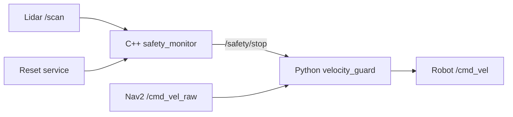

# Project 1: ROS 2 Robot Safety Monitor

A small, interview-ready ROS 2 system that prevents a mobile robot from driving into an obstacle. A C++ node evaluates lidar data and latches a stop state. A Python node sits between the navigation command and the robot, forwarding safe commands and replacing unsafe commands with zero velocity.

## What this project showcases

- ROS 2 Jazzy nodes, topics, services, parameters, launch files, and QoS
- C++ and Python nodes working in one system
- Object-oriented design and separation of sensing from actuation
- `sensor_msgs/LaserScan`, `geometry_msgs/Twist`, and `std_srvs/Trigger`
- CMake, colcon, YAML configuration, unit testing, Bash, Linux, and Docker
- A safety-oriented engineering decision: the stop is latched and must be reset

This is intentionally smaller than a navigation project. Its purpose is to demonstrate that you understand ROS 2 communication and safe robot integration before using Nav2.

## Architecture



| Interface | Type | Purpose |
| --- | --- | --- |
| `/scan` | `sensor_msgs/msg/LaserScan` | Supplies lidar ranges. |
| `/safety/stop` | `std_msgs/msg/Bool` | Publishes the latched safety state. |
| `/safety/min_clearance` | `std_msgs/msg/Float32` | Exposes the closest valid forward obstacle for debugging and metrics. |
| `/safety/reset` | `std_srvs/srv/Trigger` | Clears the latch only when the path is safe. |
| `/cmd_vel_raw` | `geometry_msgs/msg/Twist` | Receives the desired command from teleop or Nav2. |
| `/cmd_vel` | `geometry_msgs/msg/Twist` | Sends the filtered command to the robot base. |

## Why each design choice is used

- **C++ for lidar processing:** sensor callbacks can be frequent; C++ is a natural fit for deterministic robot-side processing and demonstrates the resume's C++ skill.
- **Python for command guarding:** the policy is concise and easy to extend or test, demonstrating multi-language ROS 2 integration.
- **A forward field of view:** a robot normally should not stop for a wall behind it while driving forward. The angle is configurable.
- **A latched stop:** a single clear scan should not immediately restart a robot after an unsafe event. An operator must explicitly reset it.
- **Transient-local QoS for the stop state:** a newly started guard immediately receives the latest safety state instead of temporarily assuming the robot is safe.
- **Pure C++ safety logic:** range evaluation is isolated from ROS APIs, which makes it easy to unit-test.

## Repository layout

```text
project_01_robot_safety_monitor/
├── config/safety.yaml
├── docker/Dockerfile
├── include/robot_safety_monitor/safety_logic.hpp
├── launch/safety_system.launch.py
├── scripts/demo_scan_publisher.py
├── scripts/velocity_guard.py
├── src/safety_monitor.cpp
├── test/test_safety_logic.cpp
├── CMakeLists.txt
├── package.xml
└── README.md
```

## Part 1 - Build and run

### 1. Prepare the workspace

Use Ubuntu 24.04 with ROS 2 Jazzy:

```bash
mkdir -p ~/robotics_ws/src
cp -r project_01_robot_safety_monitor ~/robotics_ws/src/robot_safety_monitor
cd ~/robotics_ws
rosdep install --from-paths src --ignore-src -r -y
colcon build --symlink-install
source install/setup.bash
```

Why: a colcon workspace keeps source, build, install, and logs separate. `--symlink-install` makes Python and launch-file iteration faster.

### 2. Run the safety system

```bash
ros2 launch robot_safety_monitor safety_system.launch.py
```

The launch file starts both nodes and loads the same YAML configuration every time, making the demo reproducible.

### 3. Connect a command source

Before using Gazebo or hardware, test with the included synthetic lidar in a second terminal:

```bash
source ~/robotics_ws/install/setup.bash
ros2 run robot_safety_monitor demo_scan_publisher
```

The default obstacle is at 2.0 m, so the system remains clear. Move it inside the 0.45 m stop threshold:

```bash
ros2 param set /demo_scan_publisher obstacle_distance 0.30
```

Then move it away and reset the latch:

```bash
ros2 param set /demo_scan_publisher obstacle_distance 2.0
ros2 service call /safety/reset std_srvs/srv/Trigger "{}"
```

This synthetic publisher is for repeatable functional checks; the final video should use TurtleBot3 Gazebo or real hardware.

### 4. Connect a robot command source

For TurtleBot3 teleoperation, remap its output to the guarded input:

```bash
ros2 run turtlebot3_teleop teleop_keyboard --ros-args -r /cmd_vel:=/cmd_vel_raw
```

The guard becomes the only node allowed to publish the final `/cmd_vel` command.

### 5. Inspect the system

```bash
ros2 topic echo /safety/min_clearance
ros2 topic echo /safety/stop
ros2 node info /safety_monitor
ros2 topic hz /scan
```

### 6. Reset after clearing the obstacle

```bash
ros2 service call /safety/reset std_srvs/srv/Trigger "{}"
```

The request fails if the closest forward obstacle is still inside the release distance. This prevents an unsafe manual override.

## Part 1 - Tests

```bash
cd ~/robotics_ws
colcon test --packages-select robot_safety_monitor
colcon test-result --verbose
```

The initial tests cover clear space, a frontal obstacle, invalid lidar values, and an obstacle outside the configured field of view.

## Demo experiment and measurable results

Record a bag while driving toward a box:

```bash
ros2 bag record /scan /safety/stop /safety/min_clearance /cmd_vel_raw /cmd_vel
```

For the README results table, measure:

| Metric | How to measure | Target |
| --- | --- | --- |
| Stop threshold error | Actual minimum clearance minus configured threshold | Within one lidar range bin |
| Stop reaction latency | Time from unsafe scan stamp to first zero `/cmd_vel` | Below 100 ms in simulation |
| False stops | Stops during five clear-path runs | 0 |
| Reset safety | Reset attempts accepted while obstacle remains | 0 |

Do not claim these targets as results until they are measured on your machine.

## Interview explanation

"I built a two-node ROS 2 safety layer for a mobile robot. A testable C++ node filters lidar ranges within a configurable forward field of view and publishes a latched stop state using transient-local QoS. A Python velocity guard isolates the robot from Nav2 or teleop commands and outputs zero velocity during a stop. I verified edge cases with unit tests and measured response latency using rosbag data."

## Next implementation parts

1. Add stale-sensor detection and stop if `/scan` is missing.
2. Add reverse-direction protection and velocity-dependent stopping distance.
3. Add diagnostics and an RViz safety-sector marker.
4. Add a rosbag analysis script and GitHub Actions.
5. Integrate with TurtleBot3 Gazebo and record the portfolio demo.

Project 2 will reuse this safety layer below Nav2 while adding SLAM, localization, ArUco perception, and a behavior tree.
